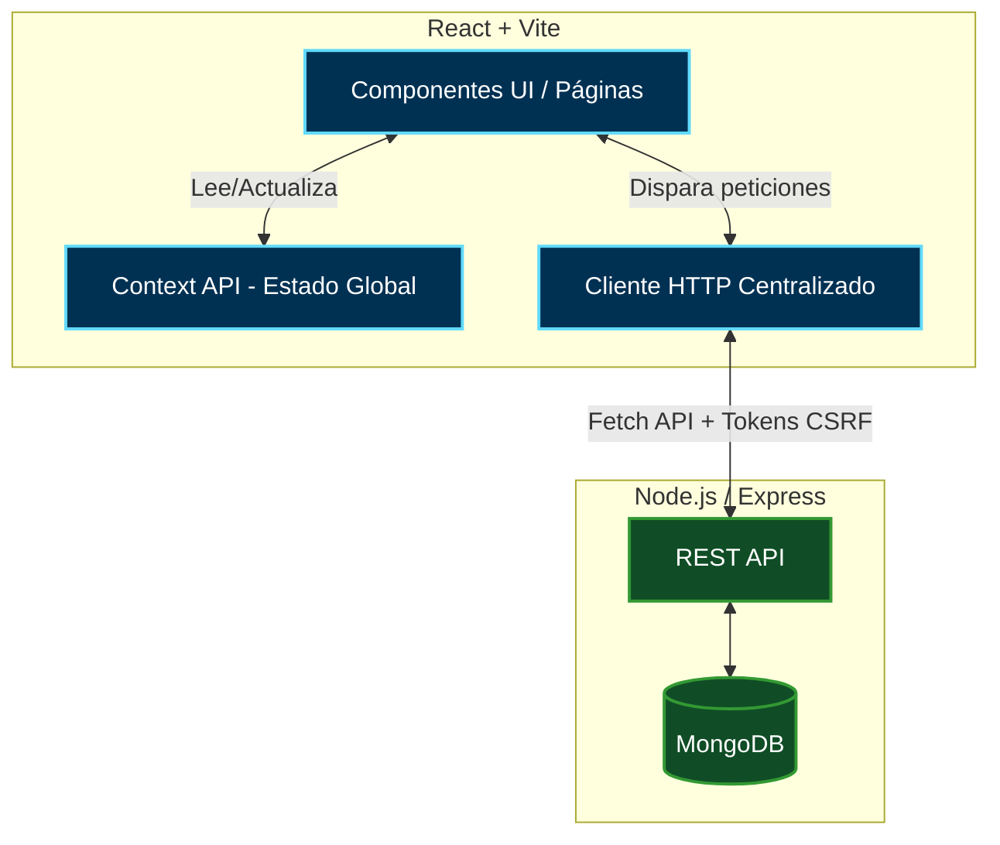
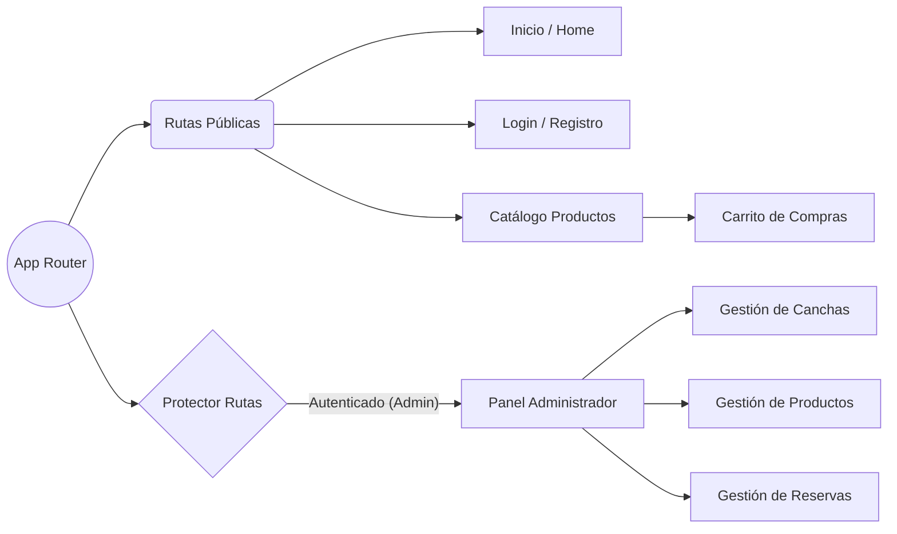

# ⚽ RollingClub - Plataforma de Gestión Deportiva (Frontend)


Frontend de la plataforma **RollingClub**, diseñada para la reserva de canchas de fútbol, gestión de usuarios y un catálogo e-commerce integrado para la compra de indumentaria y bebidas.

---

## 🏗️ Arquitectura de la Aplicación

La aplicación está diseñada con una arquitectura basada en componentes modulares, utilizando **Context API** para el estado global y un **Cliente HTTP centralizado** para estandarizar las peticiones al backend (incluyendo interceptores para CORS y CSRF).


## 🗺️ Mapa de Rutas y Code Splitting
El enrutamiento está optimizado mediante React.lazy y Suspense, separando el código en chunks (fragmentos) para que el navegador solo descargue el código de la vista que el usuario está visitando.


## ✨ Características y Funcionalidades

E-commerce Integrado: Catálogo de productos con filtros de búsqueda local, carrito de compras dinámico y cálculo de subtotales.

Gestión de Reservas: Visualización y alquiler de canchas por turnos para los clientes.

Panel Administrativo (CRUD): Creación, edición y eliminación de productos y canchas exclusivo para administradores.

Autenticación Segura: Manejo de sesiones y protección de rutas.

## 🚀 Optimizaciones y Buenas Prácticas Implementadas

 Rendimiento Visual y de Carga:

Lazy Loading de rutas mediante React.lazy y Suspense.

Memoization (React.memo, useCallback, useMemo) para evitar re-renderizados innecesarios en grillas pesadas como el catálogo.

Implementación de Skeleton Screens (animate-pulse) para transiciones fluidas durante el fetching de datos.

Seguridad HTTP: Cliente fetch centralizado (httpClient.ts) configurado con interceptores para enviar credentials: 'include' (CORS) e inyección automática de cabeceras X-CSRF-Token.

Manejo de Errores: Implementación de Error Boundaries para evitar que fallos en componentes hijos (como el carrito) colapsen toda la aplicación.

Documentación de Código: Uso de JSDoc en componentes y hooks para mejorar la experiencia de desarrollo (IntelliSense) del equipo.

Testing y Calidad: Entorno configurado con Vitest + React Testing Library para pruebas unitarias, y ESLint (Flat Config) con reglas estrictas para TypeScript y Tailwind CSS.

## 📁 Estructura del Proyecto

```Plaintext
src/
├── components/
│   ├── pages/         # Vistas completas de la app (Inicio, Login, Carrito, Admins)
│   ├── shared/        # Componentes reutilizables (Menú, Footer, Skeletons, ErrorBoundaries)
│   ├── routes/        # Lógica de protección y enrutamiento
│   └── services/      # Componentes principales de (Cancha, Producto, Reservas)
├── context/           # Estado global de la aplicación (AppContext)
├── helpers/           # Utilidades y cliente HTTP centralizado (queries.ts, httpClient.ts)
├── interfaces/        # Definiciones de tipos estrictos TypeScript (.d.ts / interfaces)
├── setupTests.ts      # Configuración global para React Testing Library
└── App.tsx            # Enrutador principal (React Router)
```
---

## 💻 Instalación y Despliegue Local
Pre-requisitos
Node.js v18 o superior

pnpm (Recomendado) o npm

1. **Clonar el repositorio:**
   ```bash
   git clone [https://github.com/gfunes/Proyecto-Final-canchaFront.git](https://github.com/gfunes/Proyecto-Final-canchaFront.git)
   ```
2. **Entrar al directorio del proyecto:**
   ```bash
   cd Proyecto-Final-canchaFront
   ```
3. **Instalar las dependencies:**
   ```bash
   pnpm install
   ```
4. **Variables de entorno:**
   
   Crea un archivo .env en la raíz del proyecto basándote en las necesidades del backend: 
   ``` code fragment
   VITE_API_URL=http://localhost:3000/api
   ```
6. Ejecución del proyecto
   Para iniciar el servidor de desarrollo, ejecuta el siguiente comando:
   ```bash
   pnpm run dev
   ```


## 🛠️ Scripts Disponibles  

pnpm dev: Inicia el servidor de desarrollo en caliente.

pnpm build: Compila el código TypeScript y construye la aplicación optimizada para producción en la carpeta dist.

pnpm preview: Previsualiza el build localmente simulando el entorno de producción.

pnpm lint: Analiza el código buscando errores sintácticos o de clases en TailwindCSS.

pnpm lint:fix: Aplica correcciones automáticas de ESLint.

pnpm test: Ejecuta la suite de pruebas unitarias usando Vitest.

---

## 👥 Autores

- **Gabriel Funes**
- **Ignacio Holmquist**
- **Patricio Moyano**

